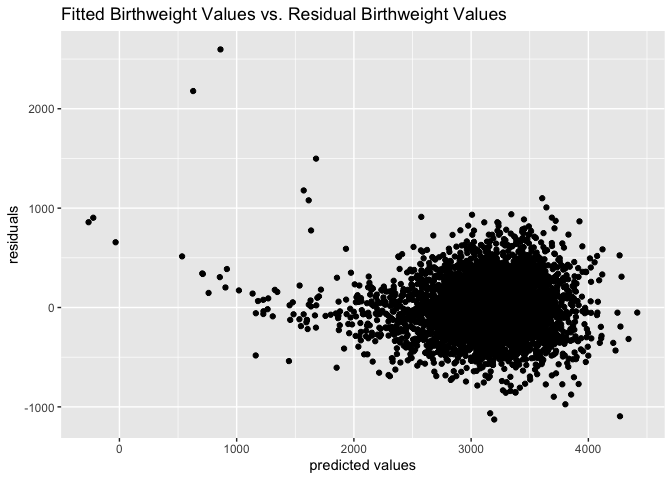
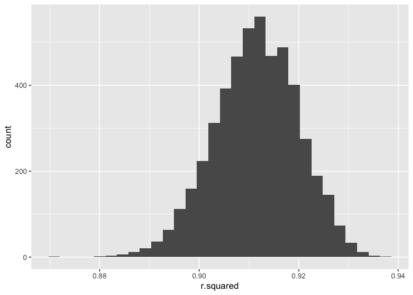

p8105\_hw6\_stl2137
================

# Problem 1

``` r
birthweight_data <- read_csv("./data/birthweight.csv") %>% 
  janitor::clean_names() %>% 
  mutate(
    babysex = as.factor(babysex),
    frace = as.factor(frace),
    malform = as.factor(malform),
    mrace = as.factor(mrace)
  )
```

    ## Parsed with column specification:
    ## cols(
    ##   .default = col_double()
    ## )

    ## See spec(...) for full column specifications.

I chose the following variables to build a model that predicts baby
birth weight based off prior knowledge of what variables are associated
with birthweight: `babysex` or the gender, `bhead` or the baby’s head
circumference at birth in centimeters, `blength` or the baby’s length at
birth in centimeters, `gaweeks` or the gestational age in weeks,
`malform` or presence of malformations that could affect weight, and
`smoken` or average number of cigarettes smoked per day during
pregnancy.

``` r
birthweight_model <- lm(bwt ~ babysex + bhead + blength + gaweeks + malform + smoken, data = birthweight_data)

birthweight_data %>% 
  modelr::add_predictions(birthweight_model) %>% 
  modelr::add_residuals(birthweight_model) %>% 
  ggplot(aes(x = pred, y = resid)) + geom_point()
```

<!-- -->

``` r
main_effects_model <- lm(bwt ~ blength + gaweeks, data = birthweight_data)

interactions_model <- lm(bwt ~ bhead + blength + babysex + bhead*blength + bhead *babysex + blength*babysex + bhead*blength*babysex, data = birthweight_data)
```

``` r
cv_df = 
  crossv_mc(birthweight_data, 4342) 

cv_df =
  cv_df %>% 
  mutate(
    train = map(train, as_tibble),
    test = map(test, as_tibble))

cv_df <- 
  cv_df %>% 
  mutate(birthweight_train_mod = map(train, ~lm(bwt ~ babysex + bhead + blength + gaweeks + malform + smoken, data = .x)), 
         main_effects_train_mod = map(train, ~lm(bwt ~ blength + gaweeks, data = .x)),
         interaction_train_mod = map(train, ~lm(bwt ~ bhead + blength + babysex + bhead*blength + bhead *babysex + blength*babysex + bhead*blength*babysex, data = .x))
  ) %>% 
  mutate(
    rmse_birthweight = map2_dbl(birthweight_train_mod, test, ~rmse(model = .x, data = .y)),
    rmse_main_effects = map2_dbl(main_effects_train_mod, test, ~rmse(model = .x, data = .y)),
    rmse_interaction = map2_dbl(interaction_train_mod, test, ~rmse(model = .x, data = .y))
  )

cv_df %>% 
  select(starts_with("rmse")) %>% 
  pivot_longer(
    everything(),
    names_to = "model", 
    values_to = "rmse",
    names_prefix = "rmse_") %>% 
  mutate(model = fct_inorder(model)) %>% 
  ggplot(aes(x = model, y = rmse)) + geom_violin()
```

<!-- -->

# Problem 2

``` r
weather_df = 
  rnoaa::meteo_pull_monitors(
    c("USW00094728"),
    var = c("PRCP", "TMIN", "TMAX"), 
    date_min = "2017-01-01",
    date_max = "2017-12-31") %>%
  mutate(
    name = recode(id, USW00094728 = "CentralPark_NY"),
    tmin = tmin / 10,
    tmax = tmax / 10) %>%
  select(name, id, everything())
```

    ## Registered S3 method overwritten by 'crul':
    ##   method                 from
    ##   as.character.form_file httr

    ## Registered S3 method overwritten by 'hoardr':
    ##   method           from
    ##   print.cache_info httr

    ## file path:          /Users/SabrinaLin/Library/Caches/rnoaa/ghcnd/USW00094728.dly

    ## file last updated:  2019-09-26 10:39:09

    ## file min/max dates: 1869-01-01 / 2019-09-30

## MAKE SURE CHANGE TO 5000

Bootstrap for \(r^2\)

``` r
simple_temp_model <- lm(tmax ~ tmin, data = weather_df) 

r.squared_bootstrap <-
  weather_df %>%
  bootstrap(50) %>% 
  mutate(
    model = map(strap, ~lm(tmax ~ tmin, data = .x)),
    results = map(model, broom::glance)
  ) %>% 
  select(-strap, -model) %>% 
  unnest(results) %>% 
  select(r.squared) 

r.squared_bootstrap %>% 
  ggplot(aes(x = r.squared)) + 
  geom_histogram()
```

    ## `stat_bin()` using `bins = 30`. Pick better value with `binwidth`.

<!-- -->

``` r
quantile(r.squared_bootstrap[[1]], c(0.025, 0.975))
```

    ##      2.5%     97.5% 
    ## 0.8970903 0.9256513

Bootstrap for \(log(\hat{\beta_0}+\hat{\beta_1})\)

``` r
log_betas_bootstrap <-
  weather_df %>%
  bootstrap(50) %>% 
  mutate(
    model = map(strap, ~lm(tmax ~ tmin, data = .x)),
    results = map(model, broom::tidy)
  ) %>% 
  select(-strap, -model) %>% 
  unnest(results) %>% 
  select(.id, term, estimate) %>% 
  mutate(
    term = recode(term, "(Intercept)" = "beta0", "tmin" = "beta1")
  ) %>% 
  group_by(.id) %>% 
  pivot_wider(
    id_cols = .id,
    names_from = term,
    values_from = estimate
  ) %>% 
  mutate(
    log_beta0_beta1 = log(beta0+beta1)
  ) %>% 
  ungroup(.id) %>% 
  select(log_beta0_beta1)

log_betas_bootstrap %>% 
  ggplot(aes(x = log_beta0_beta1)) +
  geom_histogram()
```

    ## `stat_bin()` using `bins = 30`. Pick better value with `binwidth`.

<!-- -->

``` r
quantile(log_betas_bootstrap[[1]], c(0.025, 0.975))
```

    ##     2.5%    97.5% 
    ## 2.066265 2.179031
